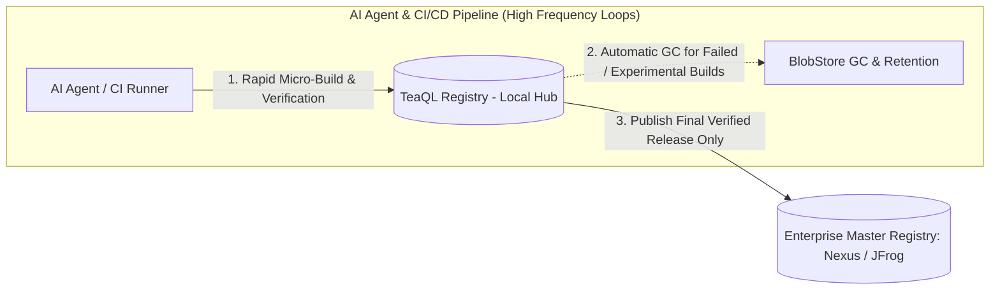
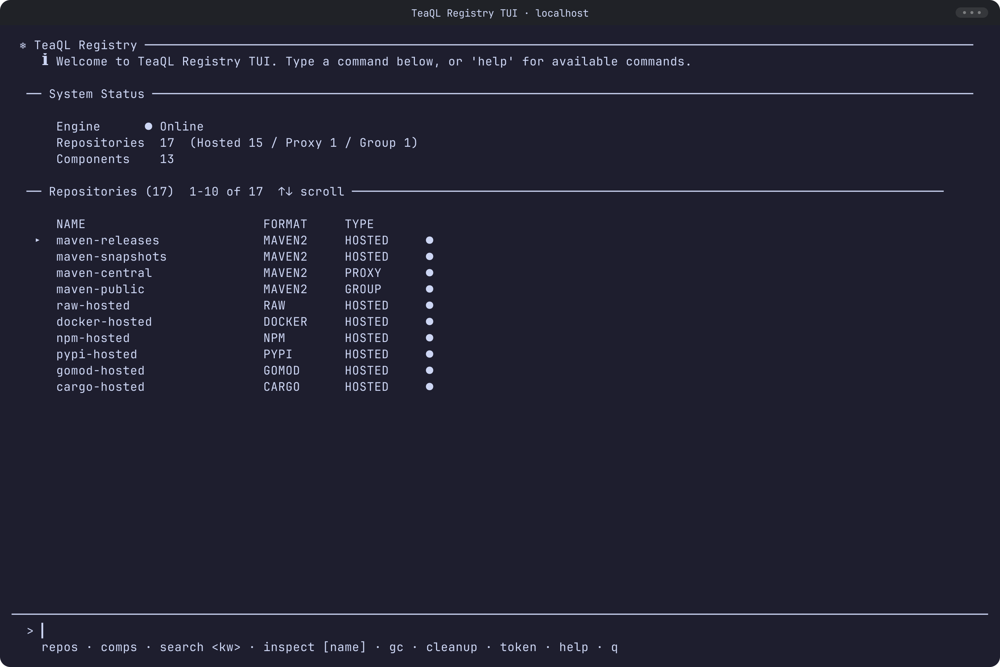
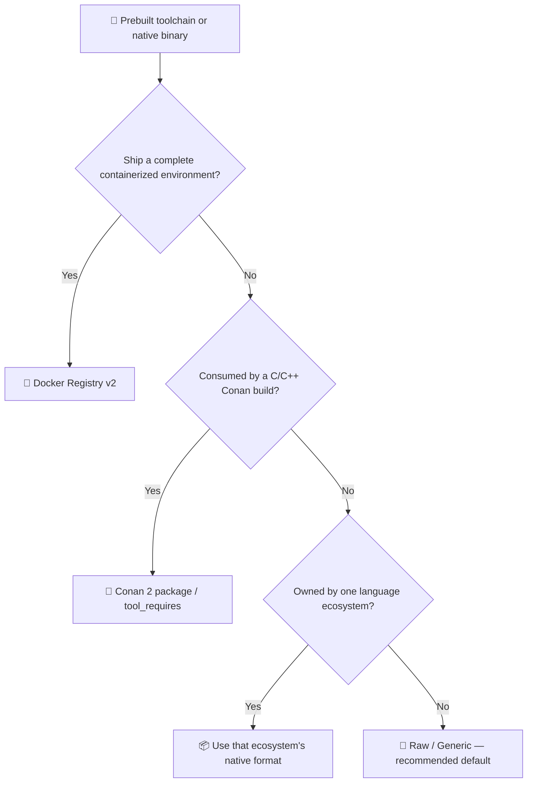

# TeaQL Registry

> **AI-Native Multi-Format Artifact Registry for Autonomous AI Coding Workflows & High-Throughput CI/CD**

---

## Overview & Core Positioning

**TeaQL Registry** is both a practical, AI-native artifact registry and a reference application demonstrating how TeaQL can be used to build a real-world, multi-protocol infrastructure service.

It is purpose-built as an **in-cluster / local intermediate artifact exchange and caching hub for AI Coding Agents and high-throughput CI/CD pipelines**.


```mermaid
graph LR
    subgraph "AI Agent & CI/CD Pipeline (High Frequency Loops)"
        A[AI Agent / CI Runner] -->|1. Rapid Micro-Build & Verification| B[(TeaQL Registry - Local Hub)]
        B -.->|2. Automatic GC for Failed / Experimental Builds| D[BlobStore GC & Retention]
    end
    B -->|3. Publish Final Verified Release Only| C[(Enterprise Master Registry: Nexus / JFrog)]
```

### Why AI-Native Coding Workflows Need a Dedicated Registry

Autonomous AI coding agents (such as SWE-bench benchmark runners, code-repair agents, and multi-agent systems) operate in rapid, autonomous execution loops:  
`Write Code -> Package -> Deploy / Test -> Observe Feedback -> Patch & Re-test`.

1. **Zero Rate Limiting & No WAF Blocking**:
   - AI agents generate hundreds of micro-releases and package queries in minutes. Standard cloud registries (e.g. GitHub Packages, Docker Hub, npmjs) quickly throttle these bursts with HTTP 429 (Too Many Requests) or WAF bot-challenge blocks.
2. **Sub-5ms Intra-Cluster Latency**:
   - Local or cluster-internal loopback routing cuts round-trip times from 200ms+ down to 1–5ms, eliminating network bottlenecks in tight AI execution loops.
3. **Air-Gapped & Egress-Controlled Sandbox Compliance**:
   - In enterprise security setups, AI sandboxes are blocked from accessing public internet to prevent prompt and source code leakage. TeaQL Registry acts as an internal proxy cache and private package repository.
4. **Inter-Agent Artifact Exchange**:
   - Allows multiple cooperating AI agents to share intermediate SNAPSHOTs, wheels, crates, and containers across microservices without external exposure.
5. **Aggressive Ephemeral Lifecycle & Garbage Collection**:
   - Automatically prunes obsolete build artifacts and collects orphaned binary blobs via content-addressed deduplication (SHA-256).

---

## Complementary to Nexus & JFrog (Not a Replacement)

TeaQL Registry is **not intended to replace enterprise master registries** like Sonatype Nexus or JFrog Artifactory. Instead, it serves as an **upstream high-speed L1 cache and staging layer**:

| Dimension | Enterprise Master (Nexus / JFrog Artifactory) | TeaQL Registry (Near-Edge Hub) |
| :--- | :--- | :--- |
| **Primary Role** | **Final Releases & Permanent Archival** | **AI Agent Loops & Ephemeral CI/CD Intermediate Builds** |
| **Retention Policy** | Long-term immutable version storage | Short-lived (minutes/hours), high churn, auto GC |
| **Security Scope** | Deep SBOM compliance, Xray vulnerability scanning | High-throughput streaming, SHA-256 deduplication, proxy caching |
| **Deployment** | Centralized enterprise datacenter or managed cloud | Sidecar / local container co-located with AI sandboxes and runners |

---

## Key Features

- **14 Artifact Formats Supported Out of the Box**:
  - 🐳 **Docker Registry v2**: Monolithic & chunked layer push/pull, manifest management.
  - ☕ **Maven2**: Release and snapshot JAR/POM uploads, SHA-1 / SHA-256 checksums.
  - 📦 **NPM**: Standard `npm publish` / `npm install` and tarball distribution.
  - 🐍 **PyPI**: Python Wheel/Tarball hosting and Simple Index (`/simple/`).
  - 🦀 **Cargo (Rust)**: Sparse Index protocol support, crate publish and download.
  - 🐹 **Go Modules**: GOPROXY specification compliance (`.info`, `.mod`, `.zip`).
  - 🟪 **NuGet (.NET)**: NuGet v3 Flat Container protocol and `dotnet nuget push`.
  - 🐦 **Swift Package Registry**: Native SwiftPM publish, resolution, manifest, source archive, checksum, and URL-to-package lookup APIs.
  - 🎯 **Dart Pub**: Hosted Pub Repository v2 package publish, metadata resolution, archive download, and checksums.
  - 💎 **RubyGems**: Native `gem push`, gem downloads, and Bundler Compact Index resolution.
  - 🐘 **Composer (PHP)**: Composer v2 repository metadata, immutable ZIP publication, and dist archive downloads.
  - 🧰 **Conan 2 (C/C++)**: Native recipe/package revision upload, resolution, search, and binary downloads.
  - 💧 **Hex (Elixir/Erlang)**: Package publication, signed registry v2 indexes, and tarball distribution.
  - 📁 **Raw / Generic**: Arbitrary binary tools, archives, and files over HTTP.
- **Pure In-Memory High-Performance Mode (`--memory-mode` / `MEMORY_MODE=true`)**:
  - In-memory volatile RAM blob storage designed for specialized scenarios requiring maximum throughput and zero I/O latency.
  - **Strict Single Latest Version Retention**: Every artifact automatically evicts prior versions upon publishing a new version to bound memory consumption.
  - **Estimated Memory Footprint**:
    - *Code-only dependencies (100–200 NPM/Cargo/PyPI/Go/Java modules)*: ~100MB – 300MB RAM.
    - *Containers & binaries (30–50 microservice images / executables)*: ~1GB – 3GB RAM.
  - **Recommendation**: For the vast majority of workflows, standard **filesystem storage** (or local S3) is the recommended default and fully sufficient, delivering sub-5ms latency via OS page cache without significant RAM overhead.
- **Embedded Web Console**:
  - React 18 + TypeScript SPA embedded directly inside the binary (zero static file dependencies, no external font/CDN requests).
  - Repository management, artifact search with install snippet generators, storage ops (GC / retention cleanup), access token management, and service log viewer.
- **Standalone Terminal TUI Client (`registry-tui`)**:
  - Zero-dependency, 2.6 MB single static binary built with Ratatui.
  - Designed for SSH jump host / bastion environments where browser access is unavailable.
  - Interactive login with password masking, connection verification before entering the UI.
  - Command-driven transcript for status, repositories, artifact search, inspection, GC, cleanup, and token generation.
- **Per-Tenant Service Logs**:
  - Best-effort operational history for artifact upload/download operations; it is isolated from the durable TeaQL mutation audit ledger and never blocks artifact traffic.
  - Records event time, username, client IP, action, repository, artifact path, content size, and status.
  - Two log types: `service` (user-facing operations) and `system` (internal errors).
  - Queryable via REST API and viewable in both Web Console and TUI; dropped and failed writes are exposed as Prometheus counters.
- **Automated Lifecycle Governance & GC**:
  - Retention policies (keep latest N versions, snapshot cleanup) and physical orphaned blob deletion.
- **CI/CD Security & Integration**:
  - Database-persisted Personal Access Tokens (`tql_pat_*`) with hashed secrets, scope enforcement, revocation, expiry, and HMAC-signed webhook event delivery.
  - Randomized admin credentials on first startup (no default passwords shipped).
- **Multi-Tenancy**:
  - Row-level tenant isolation with automated tenant provisioning and per-tenant credential generation.
- **Polymorphic Storage Engine**:
  - Pluggable S3-compatible backend (RustFS / MinIO / AWS S3), POSIX filesystem, or in-memory storage with content-addressed SHA-256 deduplication.

---

## Project Structure

```text
teaql-registry/
├── console/             # React 18 + TypeScript web console (embedded in binary)
├── registry-tui/        # Standalone terminal TUI client (ratatui)
├── models/              # TeaQL domain entity and metadata schema (model.xml)
├── rust-lib-core/       # Type-safe model operations & audited data layer (teaql-registry-core)
├── rust-web-axum/       # Protocol engines, S3 storage, REST APIs & embedded UI (teaql-registry)
├── demo-components/     # Demo sample artifacts and publish script
└── docker-compose.yml   # Complete environment setup (PostgreSQL + RustFS + Registry)
```

---

## Quick Start

### 1. Run with Docker Compose (Recommended)

```bash
git clone https://github.com/teaql/teaql-registry.git
cd teaql-registry
cp .env.example .env
# Set POSTGRES_PASSWORD and S3_SECRET_KEY to non-empty local secrets.
docker compose up -d --pull always
```

The Compose stack pulls the public multi-architecture image from
`ghcr.io/teaql/teaql-registry:latest` and starts PostgreSQL, RustFS, and the
Registry together. Set `TEAQL_REGISTRY_IMAGE` in `.env` to pin a release tag
or immutable `sha-...` image tag.

For local image development, build the current checkout through the override:

```bash
docker compose -f docker-compose.yml -f docker-compose.dev.yml up -d --build
```

Service endpoints will be available at:
- **Web Console**: `http://localhost:8081/`
- **REST API**: `http://localhost:8081/service/rest/v1/...`
- **Prometheus Metrics**: `http://localhost:8081/metrics`
- **S3 Object Storage (RustFS)**: `http://localhost:9010`
- **Quick Start Help**: `http://localhost:8081/help` (plain-text guide with all API endpoints and env vars)

> **Credentials**: Admin password is randomly generated on first startup and written to
> `/var/lib/teaql-registry/credentials/global-admin.txt` (directory `0700`, file `0600`).
> Set `CREDENTIALS_DIR` to customize this path. To use a fixed password, set `ADMIN_PASSWORD` env var before first startup.
> Tenant credentials are written to the same directory.

### 2. Run the Terminal TUI Client (`registry-tui`)

Designed for bastion hosts and SSH sessions where browser HTTP access is restricted:

```bash
# Build the TUI client
cargo build --release -p registry-tui

# Interactive login (password hidden)
registry-tui --endpoint http://10.0.0.10:8081

# Or provide credentials directly
registry-tui -e http://10.0.0.10:8081 -u admin -p <password>

# Or use a Personal Access Token
registry-tui -e http://10.0.0.10:8081 --token tql_pat_xxx

# Credentials can also be set via environment variables
export REGISTRY_ENDPOINT=http://10.0.0.10:8081
export REGISTRY_USER=admin
export REGISTRY_PASSWORD=<password>
registry-tui
```

<p align="center">
  
</p>

<p align="center"><em>Live local registry: system health, repository inventory, and interactive operations over SSH-friendly TUI.</em></p>

**TUI Controls**:

| Input | Action |
|---|---|
| `status` | Refresh system status |
| `repos` | List repositories |
| `comps [repo]` | List components, optionally filtered by repository |
| `search <keyword>` | Search artifacts |
| `inspect [name]` | Inspect the selected or named item |
| `gc` / `cleanup [repo]` | Run storage maintenance |
| `token` | Generate a temporary token |
| `↑` / `↓` | Navigate the active list or command history |
| `PageUp` / `PageDown` | Scroll the transcript |
| `help` / `q` | Show help / quit |

### 3. Seed Demo Packages

Publish live sample artifacts across the original eight fixture formats in one command:
```bash
./demo-components/publish_all_demos.sh
```

For native Swift package publication and consumption, configure the hosted
registry as follows (use HTTPS outside local development):

```bash
swift package-registry set --allow-insecure-http \
  http://localhost:8081/repository/swift-hosted/swift
swift package-registry publish teaql.MyPackage 1.0.0 \
  --url http://localhost:8081/repository/swift-hosted/swift \
  --allow-insecure-http
```

For Dart, use the repository root as the hosted URL. Publication uses the
standard Pub v2 upload handshake; authenticated repositories should be served
over HTTPS so `dart pub` can safely attach the token:

```yaml
# pubspec.yaml
name: my_package
version: 1.0.0
publish_to: https://registry.example.com/repository/dart-hosted/dart
```

```bash
dart pub token add \
  https://registry.example.com/repository/dart-hosted/dart \
  --env-var TEAQL_REGISTRY_TOKEN
dart pub publish
```

Consumers can set `PUB_HOSTED_URL` for a full mirror or use a per-dependency
`hosted` URL in `pubspec.yaml`.

RubyGems uses the repository's `/rubygems` URL for both native publication and
Bundler's Compact Index:

```bash
gem push my_package-1.0.0.gem \
  --host https://registry.example.com/repository/rubygems-hosted/rubygems
gem sources --add \
  https://registry.example.com/repository/rubygems-hosted/rubygems
gem install my_package --version 1.0.0
```

Use a TeaQL personal access token as the Pub bearer token or RubyGems API key.

Composer packages are uploaded as ZIP archives containing `composer.json`. The
path vendor and package must match the manifest name:

```bash
curl -u admin:<password> --upload-file my-package-1.2.3.zip \
  https://registry.example.com/repository/composer-hosted/composer/dist/acme/my-package/1.2.3.zip
composer config repositories.teaql composer \
  https://registry.example.com/repository/composer-hosted/composer
composer require acme/my-package:1.2.3
```

Conan 2 uses the repository's `/conan` endpoint and supports its native
Basic-login-to-bearer-token flow:

```bash
conan remote add teaql \
  https://registry.example.com/repository/conan-hosted/conan
conan remote login teaql admin -p <password>
conan upload 'hello/1.2.3' -r=teaql --confirm
conan install --requires=hello/1.2.3 -r=teaql --build=missing
```

Hex clients need the repository signing public key. Point publication at the
matching API root and use a TeaQL personal access token as `HEX_API_KEY`:

```bash
curl -o teaql-hex-public-key.pem \
  https://registry.example.com/repository/hex-hosted/hex/repo/public_key
mix hex.repo add hex-hosted \
  https://registry.example.com/repository/hex-hosted/hex/repo \
  --public-key teaql-hex-public-key.pem
HEX_API_URL=https://registry.example.com/repository/hex-hosted/hex/api \
HEX_API_KEY=tql_pat_xxx mix hex.publish --yes
```

```elixir
# mix.exs
{:my_package, "~> 1.2", repo: "hex-hosted"}
```

For production Hex repositories, configure a persistent RSA private key with
`HEX_PRIVATE_KEY_PATH` or `HEX_PRIVATE_KEY_PEM`. Without either variable, the
service creates a process-local development key whose public key changes after
a restart.

### 🧰 Distributing Prebuilt Toolchains and Platform Binaries

For compilers, code generators, SDKs, native CLIs, and cross-compilation
toolchains, choose the repository format according to how consumers resolve the
artifact:


```mermaid
flowchart TD
    A["🧰 Prebuilt toolchain or native binary"] --> B{"Ship a complete containerized environment?"}
    B -->|Yes| C["🐳 Docker Registry v2"]
    B -->|No| D{"Consumed by a C/C++ Conan build?"}
    D -->|Yes| E["🧰 Conan 2 package / tool_requires"]
    D -->|No| F{"Owned by one language ecosystem?"}
    F -->|Yes| G["📦 Use that ecosystem's native format"]
    F -->|No| H["📁 Raw / Generic — recommended default"]
```

| Icon | Format | Best fit for prebuilt artifacts | Typical consumer |
| :---: | :--- | :--- | :--- |
| 📁 | **Raw / Generic** | Cross-ecosystem CLIs, SDKs, compilers, code generators, and platform archives | `curl`, CI bootstrap scripts, custom installers |
| 🧰 | **Conan 2** | C/C++ libraries, compiler packages, and build tools selected through profiles | `conan install`, `tool_requires` |
| 🐳 | **Docker Registry v2** | Complete build images containing an OS, compiler, SDK, and system dependencies | Docker, containerd, Kubernetes runners |
| 📦 | **Native ecosystem format** | A binary or CLI intentionally installed through npm, NuGet, PyPI, Cargo, Composer, Hex, and similar clients | The ecosystem's package manager |

For a language-neutral toolchain, use a Raw repository and keep the platform
coordinates in the path:

```text
toolchains/<name>/<version>/<os>-<arch>/<archive>

toolchains/protoc/28.2/linux-x86_64/protoc-28.2.tar.gz
toolchains/protoc/28.2/linux-aarch64/protoc-28.2.tar.gz
toolchains/protoc/28.2/darwin-aarch64/protoc-28.2.tar.gz
toolchains/protoc/28.2/windows-x86_64/protoc-28.2.zip
toolchains/protoc/28.2/manifest.json
```

Publish an archive and its platform manifest with ordinary authenticated HTTP
uploads:

```bash
curl -u admin:<password> --upload-file protoc-28.2.tar.gz \
  https://registry.example.com/repository/raw-hosted/toolchains/protoc/28.2/linux-x86_64/protoc-28.2.tar.gz
curl -u admin:<password> --upload-file manifest.json \
  https://registry.example.com/repository/raw-hosted/toolchains/protoc/28.2/manifest.json
```

The registry records content checksums and deduplicates blobs. A companion
`manifest.json` should describe the supported `os`, `arch`, entry point, archive
path, and expected SHA-256 so bootstrap scripts can select and verify the right
binary deterministically.

The controlled native-client suite publishes and consumes fixtures through the
real ecosystem tools, including a clean SwiftPM resolve and build:

```bash
./scripts/verify_native_clients.sh
```

The native Cargo check runs first: its fixture uses Serde, verifies the
published sparse-index dependency, and compiles a downloaded consumer. It
fails on stale Registry binaries that publish a dependency-free index record.
The complete native-client suite needs HTTPS for authenticated Go module
downloads; Go intentionally refuses credentials in an insecure HTTP
`GOPROXY`. A Cargo PASS in a later red multi-format run is only the Cargo gate,
not proof that the whole suite passed.

### 4. Build and Run from Source

```bash
# 1. Start storage and database dependencies
docker compose up -d postgres rustfs

# 2. Configure environment and launch service
export TEAQL_REGISTRY_SERVICE_CORE_DATABASE_URL="postgresql://localhost:5432/nexus_db"
export TEAQL_REGISTRY_SERVICE_CORE_DATABASE_USER="postgres"
export TEAQL_REGISTRY_SERVICE_CORE_DATABASE_PASSWORD="postgres"
export S3_ENDPOINT="http://127.0.0.1:9010"
export S3_ACCESS_KEY="rustfsadmin"
export S3_SECRET_KEY="rustfsadmin"
export S3_BUCKET="teaql-blobs"
export S3_REGION="us-east-1"
export PORT=8081

cargo run --release -p teaql-registry
```

### 5. Pure In-Memory High-Performance Mode

> **Resource Sizing & Guidance**: In-memory mode holds all binary payloads directly in RAM and consumes significantly more memory (estimated **100MB–300MB** for code packages; **1GB–3GB** if storing container images/binaries). Standard **filesystem or local S3 storage is the recommended default** for almost all workflows. Use memory mode specifically when running inside ephemeral stateless containers or when benchmarking ultra-low-latency agent loops.

The registry binary explicitly reserves a **32 MiB stack per Tokio worker** for the generated TeaQL schema/mutation path; this applies in both storage modes. Size high-core deployments with that per-worker virtual-memory budget in mind. The full 14-format integration suite and an isolated nine-crate Cargo publication chain pass without setting `RUST_MIN_STACK`; the underlying large-future stack cost is still a separate optimization target.

```bash
# Via CLI flag
cargo run --release -p teaql-registry -- --memory-mode

# Or via environment variable
MEMORY_MODE=true cargo run --release -p teaql-registry
```

### 6. Run the Test Suite

```bash
# Complete controlled verification (requires PostgreSQL)
export TEAQL_REGISTRY_SERVICE_CORE_DATABASE_URL="postgresql://localhost:5432/nexus_db"
export TEAQL_REGISTRY_SERVICE_CORE_DATABASE_USER="postgres"
export TEAQL_REGISTRY_SERVICE_CORE_DATABASE_PASSWORD="postgres"
./scripts/verify.sh

# Run the same gates and retain versions plus complete logs as evidence
VERIFICATION_RUN_ID=my-run ./scripts/record_verification.sh

# Individual TUI tests (no dependencies, uses a mock API)
cargo test -p registry-tui
```

The verification script is the local equivalent of CI: it checks formatting,
the generated domain library, strict application-owned Clippy lints, the full
workspace test suite, and patch whitespace. It intentionally requires an
explicit database configuration so a successful run is retained evidence of
the environment that was actually tested.

The retained 2026-10-01 baseline reports **95 passed, 0 failed** and a native
client matrix covering Cargo, Maven, npm, PyPI, Go Modules, NuGet, Swift,
Docker/OCI, and Raw binaries. See the [verification evidence](evidence/README.md)
for exact toolchain versions, per-format coverage, raw logs, and test boundaries.

---

## REST API Overview

| Endpoint | Description |
|---|---|
| `GET /help` | Plain-text quick start guide |
| `GET /service/rest/v1/repositories` | List all repositories |
| `POST /service/rest/v1/repositories/{format}/{type}` | Create a repository |
| `GET /service/rest/v1/search` | Search artifacts |
| `GET /service/rest/v1/blobstores` | List blob stores |
| `POST /service/rest/v1/gc/run` | Run garbage collection |
| `POST /service/rest/v1/cleanup/run` | Run retention cleanup |
| `GET /service/rest/v1/tokens` | List access tokens |
| `POST /service/rest/v1/tokens` | Create access token |
| `DELETE /service/rest/v1/tokens/{id}` | Revoke access token |
| `GET /service/rest/v1/service-logs` | Query service logs |
| `GET /metrics` | Prometheus metrics |

---

## License

Dual-licensed under MIT OR Apache-2.0.
