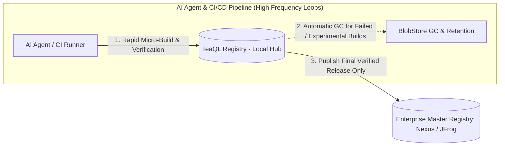

# TeaQL Registry

> **AI-Native Multi-Format Artifact Registry for Autonomous AI Coding Workflows & High-Throughput CI/CD**

---

## Overview & Core Positioning

**TeaQL Registry** is both a practical, AI-native artifact registry and a reference application demonstrating how TeaQL can be used to build a real-world, multi-protocol infrastructure service.

It is purpose-built as an **in-cluster / local intermediate artifact exchange and caching hub for AI Coding Agents and high-throughput CI/CD pipelines**.


```mermaid
graph LR
    subgraph "AI Agent & CI/CD Pipeline (High Frequency Loops)"
        A[AI Agent / CI Runner] -->|1. Rapid Micro-Build & Verification| B[(TeaQL Registry - Local Hub)]
        B -.->|2. Automatic GC for Failed / Experimental Builds| D[BlobStore GC & Retention]
    end
    B -->|3. Publish Final Verified Release Only| C[(Enterprise Master Registry: Nexus / JFrog)]
```

### Why AI-Native Coding Workflows Need a Dedicated Registry

Autonomous AI coding agents (such as SWE-bench benchmark runners, code-repair agents, and multi-agent systems) operate in rapid, autonomous execution loops:  
`Write Code -> Package -> Deploy / Test -> Observe Feedback -> Patch & Re-test`.

1. **Zero Rate Limiting & No WAF Blocking**:
   - AI agents generate hundreds of micro-releases and package queries in minutes. Standard cloud registries (e.g. GitHub Packages, Docker Hub, npmjs) quickly throttle these bursts with HTTP 429 (Too Many Requests) or WAF bot-challenge blocks.
2. **Sub-5ms Intra-Cluster Latency**:
   - Local or cluster-internal loopback routing cuts round-trip times from 200ms+ down to 1–5ms, eliminating network bottlenecks in tight AI execution loops.
3. **Air-Gapped & Egress-Controlled Sandbox Compliance**:
   - In enterprise security setups, AI sandboxes are blocked from accessing public internet to prevent prompt and source code leakage. TeaQL Registry acts as an internal proxy cache and private package repository.
4. **Inter-Agent Artifact Exchange**:
   - Allows multiple cooperating AI agents to share intermediate SNAPSHOTs, wheels, crates, and containers across microservices without external exposure.
5. **Aggressive Ephemeral Lifecycle & Garbage Collection**:
   - Automatically prunes obsolete build artifacts and collects orphaned binary blobs via content-addressed deduplication (SHA-256).

---

## Complementary to Nexus & JFrog (Not a Replacement)

TeaQL Registry is **not intended to replace enterprise master registries** like Sonatype Nexus or JFrog Artifactory. Instead, it serves as an **upstream high-speed L1 cache and staging layer**:

| Dimension | Enterprise Master (Nexus / JFrog Artifactory) | TeaQL Registry (Near-Edge Hub) |
| :--- | :--- | :--- |
| **Primary Role** | **Final Releases & Permanent Archival** | **AI Agent Loops & Ephemeral CI/CD Intermediate Builds** |
| **Retention Policy** | Long-term immutable version storage | Short-lived (minutes/hours), high churn, auto GC |
| **Security Scope** | Deep SBOM compliance, Xray vulnerability scanning | High-throughput streaming, SHA-256 deduplication, proxy caching |
| **Deployment** | Centralized enterprise datacenter or managed cloud | Sidecar / local container co-located with AI sandboxes and runners |

---

## Key Features

- **8 Package Ecosystems Supported Out of the Box**:
  - **Docker Registry v2**: Monolithic & chunked layer push/pull, manifest management.
  - **Maven2**: Release and snapshot JAR/POM uploads, SHA-1 / SHA-256 checksums.
  - **NPM**: Standard `npm publish` / `npm install` and tarball distribution.
  - **PyPI**: Python Wheel/Tarball hosting and Simple Index (`/simple/`).
  - **Cargo (Rust)**: Sparse Index protocol support, crate publish and download.
  - **Go Modules**: GOPROXY specification compliance (`.info`, `.mod`, `.zip`).
  - **NuGet (.NET)**: NuGet v3 Flat Container protocol and `dotnet nuget push`.
  - **Raw**: Arbitrary binary tools, archives, and files over HTTP.
- **Pure In-Memory High-Performance Mode (`--memory-mode` / `MEMORY_MODE=true`)**:
  - In-memory volatile RAM blob storage designed for specialized scenarios requiring maximum throughput and zero I/O latency.
  - **Strict Single Latest Version Retention**: Every artifact automatically evicts prior versions upon publishing a new version to bound memory consumption.
  - **Estimated Memory Footprint**:
    - *Code-only dependencies (100–200 NPM/Cargo/PyPI/Go/Java modules)*: ~100MB – 300MB RAM.
    - *Containers & binaries (30–50 microservice images / executables)*: ~1GB – 3GB RAM.
  - **Recommendation**: For the vast majority of workflows, standard **filesystem storage** (or local S3) is the recommended default and fully sufficient, delivering sub-5ms latency via OS page cache without significant RAM overhead.
- **Embedded Web Console**:
  - React 18 + TypeScript SPA embedded directly inside the binary (zero static file dependencies, no external font/CDN requests).
  - Repository management, artifact search with install snippet generators, storage ops (GC / retention cleanup), access token management, and service log viewer.
- **Standalone Terminal TUI Client (`registry-tui`)**:
  - Zero-dependency, 2.6 MB single static binary built with Ratatui.
  - Designed for SSH jump host / bastion environments where browser access is unavailable.
  - Interactive login with password masking, connection verification before entering the UI.
  - Tabs: Overview & Metrics, Repositories, Artifact Search, Quick Ops (GC, cleanup, token generation).
- **Per-Tenant Service Logs**:
  - Best-effort operational history for artifact upload/download operations; it is isolated from the durable TeaQL mutation audit ledger and never blocks artifact traffic.
  - Records event time, username, client IP, action, repository, artifact path, content size, and status.
  - Two log types: `service` (user-facing operations) and `system` (internal errors).
  - Queryable via REST API and viewable in both Web Console and TUI; dropped and failed writes are exposed as Prometheus counters.
- **Automated Lifecycle Governance & GC**:
  - Retention policies (keep latest N versions, snapshot cleanup) and physical orphaned blob deletion.
- **CI/CD Security & Integration**:
  - Database-persisted Personal Access Tokens (`tql_pat_*`) with hashed secrets, scope enforcement, revocation, expiry, and HMAC-signed webhook event delivery.
  - Randomized admin credentials on first startup (no default passwords shipped).
- **Multi-Tenancy**:
  - Row-level tenant isolation with automated tenant provisioning and per-tenant credential generation.
- **Polymorphic Storage Engine**:
  - Pluggable S3-compatible backend (RustFS / MinIO / AWS S3), POSIX filesystem, or in-memory storage with content-addressed SHA-256 deduplication.

---

## Project Structure

```text
teaql-registry/
├── console/             # React 18 + TypeScript web console (embedded in binary)
├── registry-tui/        # Standalone terminal TUI client (ratatui)
├── models/              # TeaQL domain entity and metadata schema (model.xml)
├── rust-lib-core/       # Type-safe model operations & audited data layer (teaql-registry-core)
├── rust-web-axum/       # Protocol engines, S3 storage, REST APIs & embedded UI (teaql-registry)
├── demo-components/     # Demo sample artifacts for all 8 formats & publish script
└── docker-compose.yml   # Complete environment setup (PostgreSQL + RustFS + Registry)
```

---

## Quick Start

### 1. Run with Docker Compose (Recommended)

```bash
cp .env.example .env
# Set POSTGRES_PASSWORD and S3_SECRET_KEY to non-empty local secrets.
docker compose up -d
```

Service endpoints will be available at:
- **Web Console**: `http://localhost:8081/`
- **REST API**: `http://localhost:8081/service/rest/v1/...`
- **Prometheus Metrics**: `http://localhost:8081/metrics`
- **S3 Object Storage (RustFS)**: `http://localhost:9010`
- **Quick Start Help**: `http://localhost:8081/help` (plain-text guide with all API endpoints and env vars)

> **Credentials**: Admin password is randomly generated on first startup and written to
> `/var/lib/teaql-registry/credentials/global-admin.txt` (directory `0700`, file `0600`).
> Set `CREDENTIALS_DIR` to customize this path. To use a fixed password, set `ADMIN_PASSWORD` env var before first startup.
> Tenant credentials are written to the same directory.

### 2. Run the Terminal TUI Client (`registry-tui`)

Designed for bastion hosts and SSH sessions where browser HTTP access is restricted:

```bash
# Build the TUI client
cargo build --release -p registry-tui

# Interactive login (password hidden)
registry-tui --endpoint http://10.0.0.10:8081

# Or provide credentials directly
registry-tui -e http://10.0.0.10:8081 -u admin -p <password>

# Or use a Personal Access Token
registry-tui -e http://10.0.0.10:8081 --token tql_pat_xxx

# Credentials can also be set via environment variables
export REGISTRY_ENDPOINT=http://10.0.0.10:8081
export REGISTRY_USER=admin
export REGISTRY_PASSWORD=<password>
registry-tui
```

**TUI Controls**:

| Key | Action |
|---|---|
| `1`-`4` | Switch tabs |
| `Tab` / `Shift+Tab` | Cycle tabs |
| `/` | Search artifacts |
| `j`/`k` or `↑`/`↓` | Navigate lists |
| `r` | Refresh data |
| `g` | Run garbage collection |
| `c` | Run retention cleanup |
| `t` | Generate temporary token |
| `q` | Quit |

### 3. Seed Demo Packages (All 8 Formats)

Publish live sample artifacts across all 8 ecosystems in one command:
```bash
./demo-components/publish_all_demos.sh
```

### 4. Build and Run from Source

```bash
# 1. Start storage and database dependencies
docker compose up -d postgres rustfs

# 2. Configure environment and launch service
export TEAQL_REGISTRY_SERVICE_CORE_DATABASE_URL="postgresql://localhost:5432/nexus_db"
export TEAQL_REGISTRY_SERVICE_CORE_DATABASE_USER="postgres"
export TEAQL_REGISTRY_SERVICE_CORE_DATABASE_PASSWORD="postgres"
export S3_ENDPOINT="http://127.0.0.1:9010"
export S3_ACCESS_KEY="rustfsadmin"
export S3_SECRET_KEY="rustfsadmin"
export S3_BUCKET="teaql-blobs"
export S3_REGION="us-east-1"
export PORT=8081

cargo run --release -p teaql-registry
```

### 5. Pure In-Memory High-Performance Mode

> **Resource Sizing & Guidance**: In-memory mode holds all binary payloads directly in RAM and consumes significantly more memory (estimated **100MB–300MB** for code packages; **1GB–3GB** if storing container images/binaries). Standard **filesystem or local S3 storage is the recommended default** for almost all workflows. Use memory mode specifically when running inside ephemeral stateless containers or when benchmarking ultra-low-latency agent loops.

```bash
# Via CLI flag
cargo run --release -p teaql-registry -- --memory-mode

# Or via environment variable
MEMORY_MODE=true cargo run --release -p teaql-registry
```

### 6. Run the Test Suite

```bash
# Complete controlled verification (requires PostgreSQL)
export TEAQL_REGISTRY_SERVICE_CORE_DATABASE_URL="postgresql://localhost:5432/nexus_db"
export TEAQL_REGISTRY_SERVICE_CORE_DATABASE_USER="postgres"
export TEAQL_REGISTRY_SERVICE_CORE_DATABASE_PASSWORD="postgres"
./scripts/verify.sh

# Individual TUI tests (no dependencies, uses a mock API)
cargo test -p registry-tui
```

The verification script is the local equivalent of CI: it checks formatting,
the generated domain library, strict application-owned Clippy lints, the full
workspace test suite, and patch whitespace. It intentionally requires an
explicit database configuration so a successful run is retained evidence of
the environment that was actually tested.

---

## REST API Overview

| Endpoint | Description |
|---|---|
| `GET /help` | Plain-text quick start guide |
| `GET /service/rest/v1/repositories` | List all repositories |
| `POST /service/rest/v1/repositories/{format}/{type}` | Create a repository |
| `GET /service/rest/v1/search` | Search artifacts |
| `GET /service/rest/v1/blobstores` | List blob stores |
| `POST /service/rest/v1/gc/run` | Run garbage collection |
| `POST /service/rest/v1/cleanup/run` | Run retention cleanup |
| `GET /service/rest/v1/tokens` | List access tokens |
| `POST /service/rest/v1/tokens` | Create access token |
| `DELETE /service/rest/v1/tokens/{id}` | Revoke access token |
| `GET /service/rest/v1/service-logs` | Query service logs |
| `GET /metrics` | Prometheus metrics |

---

## License

Dual-licensed under MIT OR Apache-2.0.
